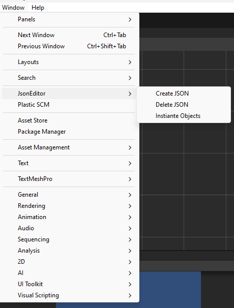

# JSON Editor Tool Tutorial

The JSON Editor tool in Unity allows you to create, edit, and manipulate game objects using JSON data. This tutorial provides step-by-step instructions on how to use the tool, along with additional functionalities such as deleting JSON data. To get started, clone the [UnityObjectTemplateGenerator](https://github.com/xlibraries/UnityObjectTemplateGenerator) repository.

## Getting Started

1. **Clone the Repository:**
   - Clone the [UnityObjectTemplateGenerator](https://github.com/xlibraries/UnityObjectTemplateGenerator) repository from GitHub to your local machine.

2. **Accessing the Tools:**
   - Open Unity and navigate to the `Window` menu.
   - Select the desired tool (JsonCreator, JsonUpdater, JsonLoader, JsonDeleter) to open the corresponding JSON Editor tool.
	- 

## JSON Editor Overview

The JSON Editor tool comprises several functionalities for creating, updating, loading, and deleting JSON data. Here's an overview of each tool:

### 1. JsonCreator

- **Creating JSON Data:**
  - Open the JSON Editor tool.
  - Enter a desired filename for the JSON file.
  - Fill in information for each entry (Name, Parent, Position, Rotation, Scale, Color).
  - Use the provided buttons to add, delete, or manipulate entries.
  - Click "Create JSON" to save the JSON data to a file.

### 2. JsonUpdater

- **Updating JSON Data:**
  - Open the JSON Editor tool.
  - Click "Load JSON" to select an existing JSON file.
  - Modify the loaded JSON data as needed.
  - Click "Update JSON" to save the changes to the file.

### 3. JsonLoader

- **Loading JSON Data:**
  - Open the JSON Editor tool.
  - Click "Load JSON Data" to select an existing JSON file.
  - The loaded JSON data will be displayed, allowing you to review and make further edits if needed.

### 4. JsonDeleter

- **Deleting JSON Data:**
  - Open the JSON Deleter tool.
  - Click "Delete JSON Data" to select an existing JSON file.
  - The selected JSON file will be deleted.

## Conclusion

The JSON Editor tool simplifies the process of creating, updating, loading, and deleting game objects through JSON data in Unity. Integrate these tools into your Unity workflow, customize them to fit your needs, and explore their capabilities for efficiently handling game object data.