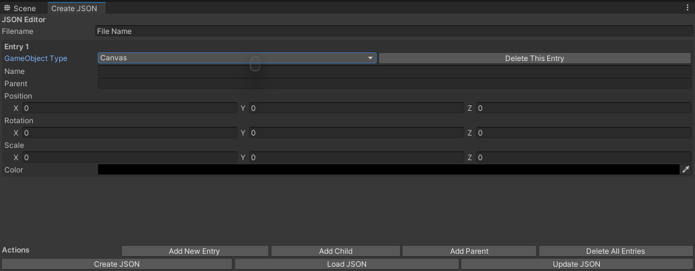
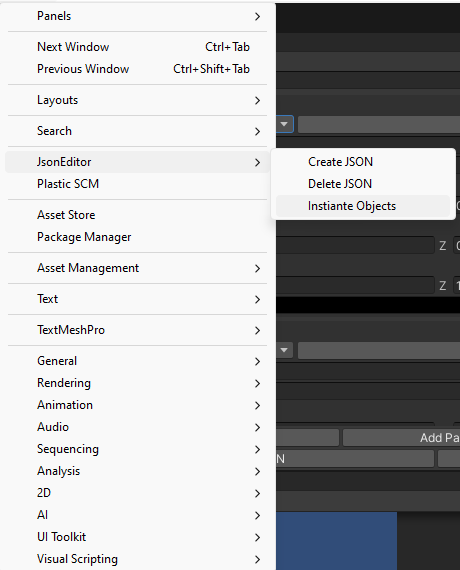
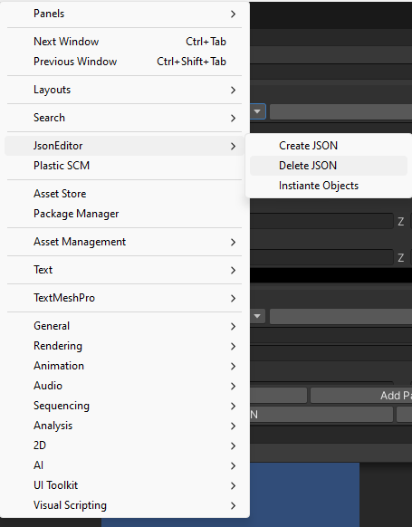

# UnityObjectTemplateGenerator
  a Unity tool that generates UI object templates using JSON data. Object templates are predefined configurations for object hierarchies that can be easily instantiated and customized in Unity scenes.

How To use:
Step1:

Step2:
// unordered list
* <b>For Creating Template<b>
Add entries in create json as needed

Click on Create Json
* <b>For Loading Template<b>
	* Click on Load Json
	* Select the json file
* <b>For Updating Template<b>
	* Click on Load Json Template
	* Select the json file
	* Update the Entries
* <b> For Instianting Objects <b>
	* Click on Instantiate Objects
  * 
	* Select the template
* <b>For Deleting Template<b>
  * Click on Delete Template
	* 
  * Select the template
